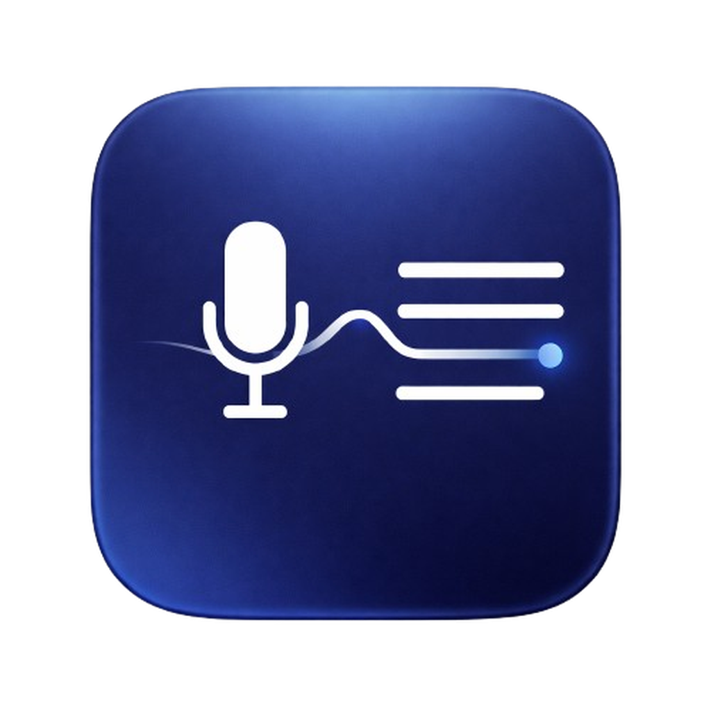

# MinuteWave - Local-First AI Meeting Copilot for macOS

<p align="center">
  
</p>

<p align="center">
  Record meetings, transcribe speech, separate speakers, generate summaries, and chat with your transcript.
</p>

<p align="center">
  <a href="https://github.com/LeonardSEO/MinuteWave/actions/workflows/release.yml"></a>
  <a href="https://github.com/LeonardSEO/MinuteWave/releases"></a>
  <a href="https://github.com/LeonardSEO/MinuteWave/releases"></a>
  <a href="LICENSE"></a>
  
</p>

<p align="center">
  <a href="https://github.com/LeonardSEO/MinuteWave/releases/latest/download/MinuteWave-macOS.dmg">
    
  </a>
</p>

## What MinuteWave Does

MinuteWave is a native SwiftUI macOS app focused on fast, private meeting workflows:

- Capture microphone and system audio.
- Produce transcripts with speaker labels (diarization).
- Generate clean meeting summaries.
- Ask follow-up questions in transcript-aware chat.
- Export results as `Markdown`, `TXT`, or `JSON`.

## Key Features

### Recording and Audio Capture

- Native recording flow for macOS.
- Two capture modes:
  - `Microphone only`
  - `Microphone + system audio`
- Built-in elapsed timer and session management.

### Transcription

- Local-first transcription using FluidAudio (`Parakeet TDT v3`) with offline diarization.
- Cloud transcription options:
  - Azure OpenAI
  - OpenAI
- Fallback behavior and provider health/status feedback in-app.

### Summaries and Transcript Chat

- Generate executive summaries from completed transcripts.
- Ask questions against transcript content with retrieval-based context selection.
- Configurable summary prompt template.

### Integrations

MinuteWave can work with:

- **Azure OpenAI**
  - Configurable endpoint, API versions, and deployments for chat/summary/transcription.
- **OpenAI API**
  - Configurable base URL and models for chat/summary/transcription.
- **LM Studio (local server)**
  - Local endpoint for summary + transcript chat.
  - Loaded model selection from running LM Studio instance.

## Security and Privacy

- Local transcription path available for privacy-sensitive workflows.
- API secrets stored in macOS Keychain.
- Optional SQLCipher-backed database encryption with migration support.
- Session data stored locally (SQLite) under app support directories.

## Requirements

- macOS 14+
- Apple Silicon Mac
- 16 GB RAM recommended (and required by onboarding checks for full local workflow)

## Install (DMG)

1. Download: [Latest release](https://github.com/LeonardSEO/MinuteWave/releases/latest)
2. Open `MinuteWave-macOS.dmg`
3. Drag `MinuteWave.app` to `Applications`
4. First launch: right-click app -> **Open**

### Gatekeeper Behavior (Important)

- `spctl --assess` can still return `rejected` when builds are not notarized.
- `codesign --verify` can still be valid while Gatekeeper rejects distribution trust.
- If macOS blocks launch:
  1. Right-click app -> **Open**
  2. Or in terminal: `xattr -dr com.apple.quarantine "/Applications/MinuteWave.app"`

### Code Signing Options

- **Free Apple ID / Personal Team (Xcode):** good for local development on your own Mac; not suitable for public distribution.
- **Paid Apple Developer Program:** required for `Developer ID Application` signing + notarization for clean public install flow.

## Build From Source

```bash
swift build
swift run MinuteWave
```

Run tests:

```bash
swift test
```

Create DMG:

```bash
./scripts/build_dmg.sh release
```

Optional: sign app bundle with a local identity before DMG build:

```bash
security find-identity -v -p codesigning
SIGNING_IDENTITY="Apple Development: Your Name (TEAMID)" ./scripts/build_dev_app_bundle.sh release
```

## Architecture (High-Level)

```text
Mic + System Audio
       |
       v
HybridAudioCaptureEngine
       |
       +--> Local FluidAudio (ASR + diarization)
       +--> Azure/OpenAI transcription provider

Transcript + metadata -> SQLite repository
                         |
                         +--> Summary providers (Azure/OpenAI/LM Studio)
                         +--> Transcript chat providers (Azure/OpenAI/LM Studio)
                         +--> ExportService (MD/TXT/JSON)
```

## Versioning and Releases

- Versioning format: `vMAJOR.MINOR.PATCH`.
- App version source: `Sources/AINoteTakerApp/Resources/AppInfo.plist`.
- Release workflow: `.github/workflows/release.yml`.
- On each tag push (example `v0.1.4`), GitHub Actions builds and publishes release assets.
- Optional GitHub signing: configure repository secrets to sign release builds with Apple Development.

### GitHub Apple Development Signing (Optional)

Set these repository secrets in GitHub:

- `APPLE_DEV_CERT_P12_BASE64` (base64 of exported `.p12` certificate)
- `APPLE_DEV_CERT_PASSWORD` (password used when exporting `.p12`)
- `APPLE_DEV_SIGNING_IDENTITY` (example: `Apple Development: Leonard van Hemert (3RSGDZZR5Z)`)

Create the base64 value locally:

```bash
base64 -i ~/Desktop/apple-development.p12 | pbcopy
```

## Current Release

- `v0.1.4`
- DMG asset: `MinuteWave-macOS.dmg`

## Documentation

- macOS permissions setup: `docs/XcodePermissionsSetup.md`

## License

MIT License. See [LICENSE](LICENSE).
