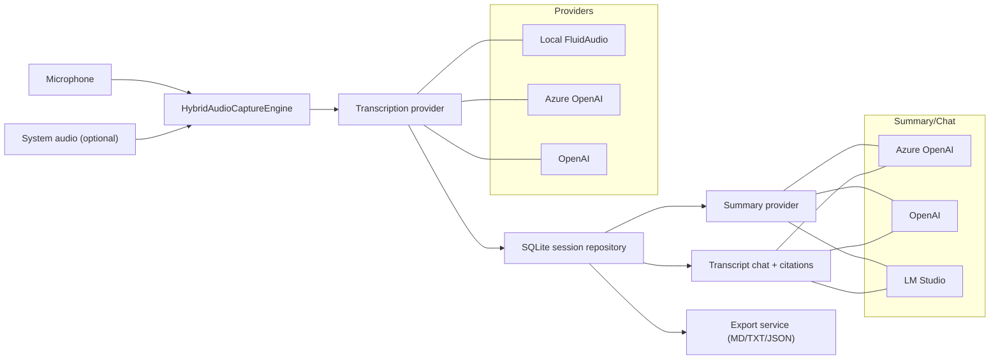

<h1 align="center">
  <br>
  
  <br>
  MinuteWave
  <br>
</h1>

<p align="center">
  <strong>Local-first AI meeting copilot for macOS.</strong>
</p>

<p align="center">
  Capture meeting audio, generate high-quality transcripts with speaker labels, create structured summaries, and chat with transcript-grounded citations.
</p>

<p align="center">
  <a href="https://github.com/LeonardSEO/MinuteWave/actions/workflows/release.yml"></a>
  <a href="https://github.com/LeonardSEO/MinuteWave/releases"></a>
  <a href="https://github.com/LeonardSEO/MinuteWave/releases"></a>
  <a href="LICENSE"></a>
  
</p>

<p align="center">
  <a href="https://github.com/LeonardSEO/MinuteWave/releases/latest/download/MinuteWave-macOS.dmg"><strong>Download latest DMG</strong></a>
  ·
  <a href="docs/XcodePermissionsSetup.md"><strong>Permissions setup guide</strong></a>
</p>

## Why MinuteWave

MinuteWave is built for people who want native macOS meeting notes without a browser-first workflow:

- Local transcription path with FluidAudio (Parakeet v3 + offline diarization).
- Cloud transcription options with Azure OpenAI or OpenAI.
- Transcript-aware AI chat and summary generation.
- Session persistence, export, and optional database encryption.
- Native SwiftUI UI with onboarding, settings, and update checks.

## Feature Overview

| Area | What you get |
| --- | --- |
| Audio capture | `Microphone only` or `Microphone + system audio` capture modes |
| Transcription | Local FluidAudio, Azure OpenAI Whisper, or OpenAI Whisper |
| Speaker labels | Offline diarization in local FluidAudio mode |
| Summary | Structured markdown summary generation from transcript content |
| Transcript chat | Q&A with lexical retrieval and timestamp citations |
| Export | `Markdown`, `TXT`, and `JSON` export per session |
| Storage | Local SQLite session store + Keychain-backed secrets |
| Security | Optional SQLCipher encryption mode with migration support |
| UX | EN/NL app localization, onboarding wizard, update checker |

### Provider Matrix

| Capability | Local FluidAudio | Azure OpenAI | OpenAI | LM Studio |
| --- | --- | --- | --- | --- |
| Transcription | Yes | Yes | Yes | No |
| Summary | No | Yes | Yes | Yes |
| Transcript chat | No | Yes | Yes | Yes |
| API key required | No | Yes | Yes | Optional |

## Architecture



## System Requirements

- macOS `14+`
- Apple Silicon Mac
- `16 GB RAM` minimum (enforced by onboarding checks)
- Internet connection for cloud providers and first local model download

## Installation (DMG)

1. Download from [latest release](https://github.com/LeonardSEO/MinuteWave/releases/latest).
2. Open `MinuteWave-macOS.dmg`.
3. Drag `MinuteWave.app` to `Applications`.
4. Start with right-click -> `Open` on first run.

> [!IMPORTANT]
> If Gatekeeper blocks launch, use one of these options:
> 1. `System Settings -> Privacy & Security -> Open Anyway`
> 2. `xattr -dr com.apple.quarantine "/Applications/MinuteWave.app"`

## Quick Start

1. Complete onboarding permissions (`Microphone`, and optionally `Screen Recording` for system audio capture).
2. Choose your transcription provider (`Local (FluidAudio)` for local-first workflow, or `Azure`/`OpenAI` for cloud transcription).
3. (Optional) Configure summary/chat provider (`Azure`, `OpenAI`, or `LM Studio`).
4. Create a session, start recording, stop recording.
5. Review transcript, generate summary, ask follow-up questions, export results.

## Privacy & Security

- Session data is stored locally in `~/Library/Application Support/MinuteWave`.
- API keys are stored in macOS Keychain.
- Database encryption can be enabled in settings when SQLCipher runtime is available.
- Encryption migrations (plaintext <-> SQLCipher) are built in.
- Local FluidAudio mode keeps inference on-device after model preparation.

## Build From Source

### Prerequisites

- Xcode (latest stable)
- Swift 6 toolchain
- Homebrew packages:

```bash
brew install sqlcipher create-dmg
```

### Build and run

```bash
swift build
swift test
swift run MinuteWave
```

For reliable macOS permission prompts, run as a real app bundle:

```bash
./scripts/build_dev_app_bundle.sh debug
open ".build/AppBundle/MinuteWave.app"
```

### Build DMG

```bash
./scripts/build_dmg.sh release
```

Optional signing:

```bash
security find-identity -v -p codesigning
SIGNING_IDENTITY="Apple Development: Your Name (TEAMID)" ./scripts/build_dev_app_bundle.sh release
```

## Release and CI

- Release workflow: `.github/workflows/release.yml`
- Tag format: `vMAJOR.MINOR.PATCH`
- Release artifacts: `MinuteWave-macOS.dmg`, `MinuteWave-macOS.dmg.sha256`

## Troubleshooting

- Permission issues: see [`docs/XcodePermissionsSetup.md`](docs/XcodePermissionsSetup.md)
- Reset TCC permissions:

```bash
./scripts/reset_tcc_permissions.sh
```

- LM Studio model not detected: refresh status in Settings -> `AI` tab and ensure at least one model is loaded.

## Star History

[](https://www.star-history.com/#LeonardSEO/MinuteWave&type=date&legend=top-left)

## License

MIT License. See [LICENSE](LICENSE).
